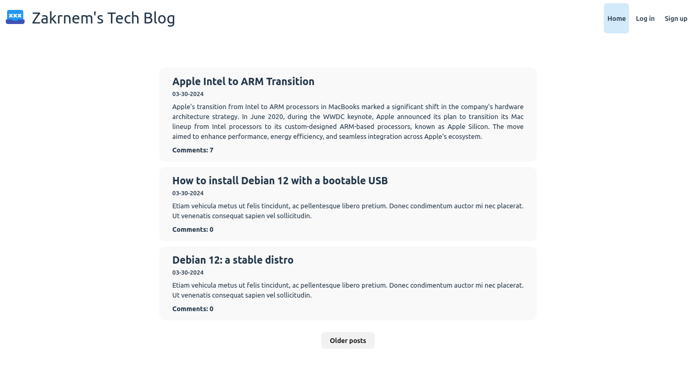

# Blog App




The project aims to create a full-stack application where users can access blog posts, create comments after signing up and logging in, and authors can manage content by creating new posts and editing existing ones. It works in conjunction with the following repos:

- [Blog API](https://github.com/zakrnem/blogapi/)
- [Blog CMS](https://github.com/zakrnem/blog_cms/)

## Getting started

### Prerequisites

Before you begin, ensure you have the following installed on your system:

- [Node.js](https://nodejs.org/) (version 20.11.1)

### Installation

1. Clone the repository:

    ```bash
    git clone https://github.com/zakrnem/blog_frontend.git
    ```

2. Navigate to project directory:

    ```bash
    cd blog_frontend
    ```

3. Install dependencies:

    ```bash
    npm i
    ```

4. Please follow the installation, configuration and execution steps for the [Blog API repository](https://github.com/zakrnem/blogapi/). It must be up and running for this frontend application to function correctly.

### Configuration

Follow these steps to configure the project:

1. Create a `.env` file in the root directory of the project.

2. Add the following environment variables to the `.env` file:

    ```plaintext
    VITE_API_URL=/api
    API_URL=http://localhost:3000/api/client
    ```

    Make sure to replace the placeholder values with your actual MongoDB cluster credentials. Adjust the `VITE_API_URL` and `API_URL` values if necessary.

3. Save the `.env` file.

These environment variables are essential for the proper functioning of the project. Ensure they are correctly set up to establish a connection with the backend server.

### Executing the app

```bash
npm run dev
```